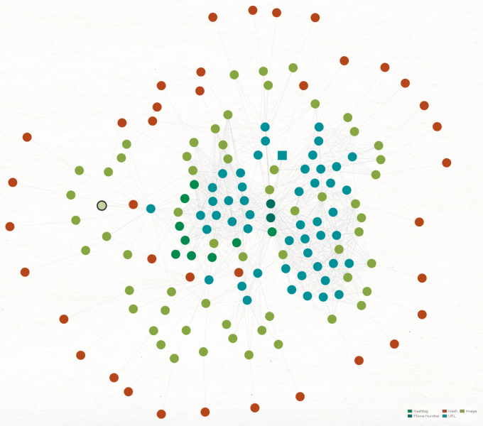

### Convert SumoSearch Results to URL Entities


Version: 1.0.0-beta

## 💎 About

Sumosear.ch is a database of escort service ads. SumoMaltego allows the researcher to fetch results from sumosear.ch using a phone number and perform Transforms on the results in Maltego. Given the potential for large results, this local Transform is best suited for Maltego Pro and Enterprise users being as the community edition severely limits the effectiveness of searching sumosear.ch with this method.

Please use this tool ethically by respecting people's privacy and only collecting intelligence where explicit permission has been granted or otherwise legally qualified to do so. We are not responsible for any illegal use.
## 🛠️ Setup

### Requirements
- Maltego 4.3.0
- [Python 3.11.2](./requirements.txt)

   
### Installation
Make sure you have virtualenv installed with ```pip install virtualenv``` before running the commands below.

```
   git clone https://github.com/kodamaChameleon/twilio-maltego.git
   cd sumoMaltego
   virtualenv venv
   source venv/bin/activate
   python3 setup.py
```
Import the sumoMaltego.mtz config generated by setup.py into Maltego. If you need to regenerate the .mtz file without running the whole setup, run ```python3 project.py list```

## 🧙 Features



| Name               | Description                                                       |
|--------------------|-------------------------------------------------------------------|
| phoneToAds           | Retrieves escort ads from sumosearc.ch using phone number | 
| phoneToImages | Retrieves escort ad images from sumosearc.ch using phone number       | 
| urlToPhone           | Scrape url for phone numbers                | 

#### Workflow
A typical workflow might look something like the following:
1. Start with a phone number entity
2. Transform phoneToAds to return sumosear.ch resulting urls
3. Scrape URLs
   - Transform Maltego Regex Transforms -> Find on webpage -> To Images [Found on web page]
   - Transform urlToPhone
   - Transform Maltego Regex Transforms -> Personal Data -> To Emails
4. Transform Maltego-LTC -> NERV -> To pHash on images
   
## 📜 License


[Creative Commons Attribution-ShareAlike 4.0 International License](https://creativecommons.org/licenses/by-sa/4.0/)  
Copyright (C) 2023 KodamaChameleon
